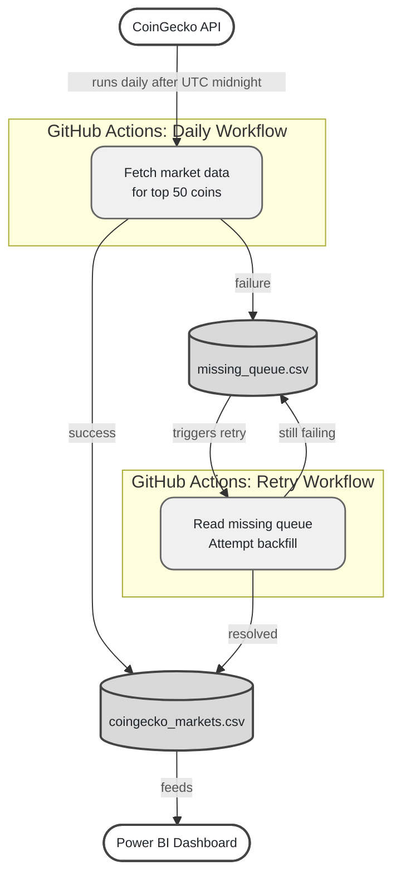

# Crypto Analytics Data Pipeline

[]
[]

An automated, fault-tolerant cryptocurrency data pipeline that ingests daily market data from the CoinGecko API and feeds a Power BI analytics dashboard.

This project focuses on robust pipeline design rather than simple data extraction.

---

## Overview

- **Source:** CoinGecko API
- **Universe:** Fixed top 50 cryptocurrencies as of 2025-12-01
- **Storage:** Version-controlled CSV dataset (GitHub)
- **Orchestration:** GitHub Actions
- **Analytics:** Power BI

---

## Architecture



---

## Pipeline Design

- Runs daily after UTC midnight
- Stores one row per coin per day (date-level grain)
- Normalises timestamps for clean analytics
- Safe to re-run without duplicating data
- Automatically recomputes rolling returns (1d / 7d / 30d)

---

## Failure Handling

- API failures are written to a durable retry queue
- A separate retry workflow runs independently
- Missing data is backfilled automatically once available
- The pipeline favours eventual consistency over hard failure

---

## Repository Structure

```text
config/   # Fixed universe definition
data/     # Fact table and retry queue
scripts/  # Ingestion and retry logic
.github/  # GitHub Actions workflows
```

---

## Acknowledgements

This project was developed with assistance from ChatGPT, 
which supported rapid code development/debugging and README drafting.
All analytical decisions, pipeline choices, and results interpretation are the author's own.
